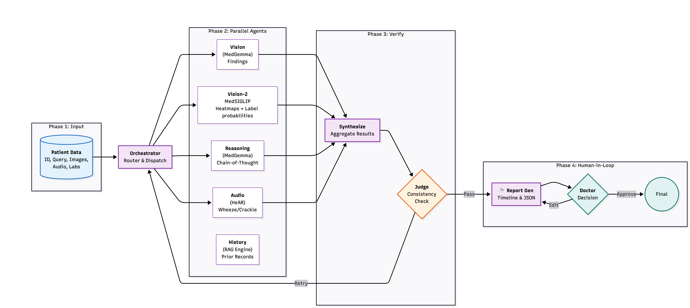
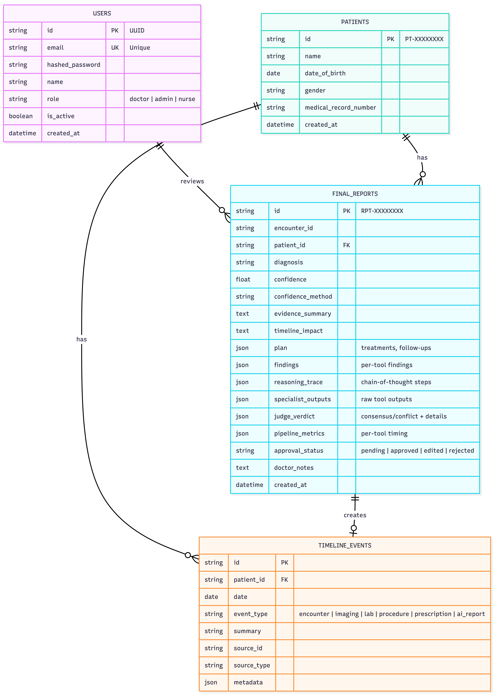

<div align="center">

# MedAI — Agentic Medical AI Assistant

**End-to-end medical AI platform with Claude orchestration, MedGemma specialist models, and explainable AI reports.**

Built for the [**MedGemma Impact Challenge**](https://www.kaggle.com/competitions/med-gemma-impact-challenge/writeups/medai) on Kaggle

[](https://python.org)
[](https://nextjs.org)
[](https://fastapi.tiangolo.com)
[](https://anthropic.com)
[](https://modal.com)
[](LICENSE)

</div>

---

## Table of Contents

1. [Overview](#overview)
2. [Architecture](#architecture)
3. [Prerequisites](#prerequisites)
4. [Setup From Zero](#setup-from-zero)
5. [Running the App](#running-the-app)
6. [Default Login Credentials](#default-login-credentials)
7. [Run Modes](#run-modes)
8. [Environment Variables](#environment-variables)
9. [Deploying GPU Models (Modal)](#deploying-gpu-models-modal)
10. [Project Structure](#project-structure)
11. [Tech Stack](#tech-stack)
12. [API Reference](#api-reference)
13. [Testing](#testing)
14. [Docker Deployment](#docker-deployment)
15. [Troubleshooting](#troubleshooting)
16. [License](#license)

---

## Overview

MedAI is a **multi-agent medical AI assistant** that combines a Claude Sonnet 4 orchestrator with specialized Google medical models (MedGemma, MedSigLIP, HeAR) to analyze medical images, audio, and clinical text. The platform produces **explainable, structured reports** with heatmap visualizations and a built-in judge for cross-modal consensus validation.

**Key capabilities:**
- **Medical image analysis** — X-rays, CT, MRI, dermatology, fundus, histopathology via MedGemma 4B
- **Clinical reasoning** — Chain-of-thought assessment with evidence citations via MedGemma 27B
- **Explainability heatmaps** — Zero-shot spatial attention maps via MedSigLIP
- **Audio analysis** — Respiratory sound classification (wheeze, crackle) via HeAR
- **Judge agent** — Cross-modal consistency verification before report finalization
- **Patient timeline** — Longitudinal tracking with historical context via RAG

You upload medical images, audio recordings, PDFs, or type clinical context — and the system:

1. **Routes** the case to the right specialist AI models (image analysis, text reasoning, audio analysis, explainability)
2. **Runs** specialist tools in parallel on GPU via Modal cloud
3. **Judges** consensus across all tool outputs
4. **Generates** a structured report with diagnosis, findings, treatment plan, confidence scores, and GradCAM attention heatmaps

The doctor can then review, approve, edit, or reject the AI report.

---

## Architecture

### Core Agent Pipeline

The orchestrator follows a 5-phase agentic loop: **Route → Dispatch → Collect → Judge → Report**.

<p align="center">
  
</p>

| Phase | Description |
|-------|-------------|
| **1. Route** | Claude analyzes the case and decides which specialist tools to invoke |
| **2. Dispatch** | Selected tools run **in parallel** via HTTP to Modal GPU endpoints |
| **3. Collect** | Results gathered; MedSigLIP auto-dispatched for any images |
| **4. Judge** | A separate Claude agent evaluates cross-modal consensus |
| **5. Report** | Final structured report with findings, plan, and explainability artifacts |

1. **ROUTE** — Claude analyzes the case and decides which specialist tools to invoke
2. **DISPATCH** — Selected tools run in parallel via HTTP to Modal GPU endpoints
3. **COLLECT** — Results gathered; MedSigLIP auto-dispatched for images if not called
4. **JUDGE** — A separate Claude agent evaluates consensus across tool outputs
5. **REPORT** — Final structured report with findings, plan, and explainability artifacts


### Domain Entities

<p align="center">
  
</p>

### Real-time Progress (SSE)

The frontend uses **Server-Sent Events** to stream pipeline progress to the UI in real-time. Each tool start/complete/error event is displayed as the analysis runs, giving doctors visibility into what's happening during the 30–90 second analysis.

---

## Prerequisites

### Required
| Layer | Technology |
|:------|:-----------|
| **Frontend** | Next.js 14 (App Router) · React 18 · TypeScript · Tailwind CSS · Zustand · TanStack Query |
| **Backend** | FastAPI · Python 3.11+ · Pydantic v2 · structlog · SQLAlchemy (async) |
| **AI Orchestrator** | Claude Sonnet 4 (Anthropic) — tool-use API with parallel calls |
| **Image Analysis** | MedGemma 4B IT (Google) — multimodal medical image understanding |
| **Text Reasoning** | MedGemma 27B IT (Google) — clinical text reasoning |
| **Explainability** | MedSigLIP (Google) — zero-shot medical image heatmaps |
| **Audio Analysis** | HeAR (Google) — health acoustic recognition |
| **Speech-to-Text** | MedASR (Google) — medical speech recognition |
| **GPU Inference** | Modal (serverless GPU — T4 / A10G / A100) |
| **Database** | SQLite (dev) / PostgreSQL (prod) |
| **Auth** | JWT (python-jose + bcrypt) |


### Required API Key

| Key | Where to get it | Cost |
|-----|-----------------|------|
| **Anthropic API Key** | [console.anthropic.com](https://console.anthropic.com/) | Pay-per-use (~$0.50–2 per analysis) |

### Optional (for real GPU mode, not needed for mock)

| Tool | Purpose | Install |
|------|---------|---------|
| **Modal CLI** | Deploy GPU models | `pip install modal && modal setup` |
| **HuggingFace account** | Access MedGemma models | [huggingface.co](https://huggingface.co/) |

> **Tip:** You can run in `mock` mode without any GPU endpoints — it returns instant mock responses for development and testing.

---

## Setup From Zero

These steps assume a fresh machine. Follow them in order.

### Step 1: Clone the Repository

```bash
git clone https://github.com/ArseniiStratiuk/MedAI.git
cd MedAI
```

### Step 2: Set Up the Backend (Python)

```bash
cd backend

# Create a virtual environment
python3 -m venv ../.venv

# Activate it
source ../.venv/bin/activate          # Linux / macOS
# ..\.venv\Scripts\activate           # Windows PowerShell

# Install all dependencies
pip install -e ".[dev,db,ml]"

# Copy the environment template and configure
cp .env.example .env

# IMPORTANT: Edit .env and set your Anthropic API key:
#   ANTHROPIC_API_KEY=sk-ant-api03-YOUR_KEY_HERE
# For mock mode (no GPU), keep DEBUG=true (the default in .env.example)
nano .env    # or use any text editor

cd ..
```

### Step 3: Set Up the Frontend (Node.js)

```bash
cd frontend

# Install JavaScript dependencies (~300MB node_modules — totally normal)
npm install --legacy-peer-deps

# Copy environment template (default values are fine for local dev)
cp .env.example .env.local
cd ..
```

### Step 4: Make Scripts Executable

```bash
chmod +x medai-run.sh medai-stop.sh medai-status.sh
```

### Step 5: Start the App

```bash
# Mock mode (no GPU needed, instant fake responses — great for first run)
./medai-run.sh --mode mock

# Verify services
./medai-status.sh
```

### Step 6: Open in Browser

Go to **http://localhost:3000**

Log in with:
- **Email:** `admin@medai.com`
- **Password:** `admin123`

### Step 7: Try an Analysis

1. Select a patient from the dropdown (or create one)
2. Type a clinical query like: *"Analyze this chest X-ray for pneumonia"*
3. Optionally attach a medical image, audio, or PDF
4. Hit **Send** — watch the pipeline progress in real-time
5. Click **"View Full Report"** to see the AI analysis with heatmaps, findings, and plan

---

## Default Login Credentials

| Email | Password | Role |
|-------|----------|------|
| `admin@medai.com` | `admin123` | admin |
| `doctor@medai.com` | `doctor123` | doctor |

---

## Running the App

### Using convenience scripts (recommended)

```bash
# Start in mock mode (default — no GPU needed)
./medai-run.sh --mode mock

# Start in real mode (uses Modal GPU endpoints + Claude)
./medai-run.sh --mode real

# Start in fast mode (real analysis, no judge step)
./medai-run.sh --mode fast

# Custom ports
./medai-run.sh --mode mock --backend-port 8001 --frontend-port 3001

# Check status
./medai-status.sh

# Stop everything
./medai-stop.sh
```

Logs are written to `medai-logs/`:

```bash
tail -f medai-logs/backend.log
tail -f medai-logs/frontend.log
```

### Running manually (two terminals)

```bash
# Terminal 1 — Backend (mock mode)
cd backend && source ../.venv/bin/activate
DEBUG=true uvicorn medai.main:app --reload --port 8000

# Terminal 2 — Frontend
cd frontend && npm run dev
```

> **Note:** `DEBUG=true` enables mock mode (no GPU endpoints needed). Omit it or set `DEBUG=false` for real mode with Modal GPU endpoints.

Open **http://localhost:3000**.

---

## Run Modes

| Mode | `DEBUG` | Judge | MedGemma 27B | Use Case |
|------|---------|-------|--------------|----------|
| `mock` | `true` | off | off | Development — instant mock responses, no API keys for GPU needed |
| `real` | `false` | on | on | Full pipeline — all models, full validation |
| `fast` | `false` | off | on | Demo — real analysis without judge overhead |
| `fastest` | `false` | off | off | Quick demo — image + history only |

---

## Environment Variables

### Backend (`backend/.env`)

Copy `backend/.env.example` to `backend/.env` and edit.

| Variable | Required | Default | Description |
|----------|----------|---------|-------------|
| `ANTHROPIC_API_KEY` | **Yes** | — | Claude API key |
| `DEBUG` | No | `false` | `true` for mock mode (no GPU endpoints needed) |
| `ORCHESTRATOR_MODEL` | No | `claude-sonnet-4-20250514` | Claude model name |
| `ORCHESTRATOR_MAX_TOKENS` | No | `8192` | Max tokens for orchestrator |
| `JUDGE_ENABLED` | No | `true` | Enable Judge agent |
| `ENABLE_27B_REASONING` | No | `true` | Enable MedGemma 27B |
| `MAX_JUDGMENT_CYCLES` | No | `1` | Max judge requery rounds |
| `MEDGEMMA_4B_ENDPOINT` | When `DEBUG=false` | — | Modal endpoint URL |
| `MEDGEMMA_27B_ENDPOINT` | When `DEBUG=false` | — | Modal endpoint URL |
| `MEDSIGLIP_ENDPOINT` | When `DEBUG=false` | — | Modal endpoint URL |
| `HEAR_ENDPOINT` | When `DEBUG=false` | — | Modal endpoint URL |
| `MEDASR_ENDPOINT` | When `DEBUG=false` | — | Modal endpoint URL |
| `DATABASE_URL` | No | `sqlite+aiosqlite:///./medai.db` | Database URL |
| `JWT_SECRET` | No | auto-generated | JWT signing secret |
| `ALLOWED_ORIGINS` | No | `["http://localhost:3000"]` | CORS origins |

### Frontend (`frontend/.env.local`)

Copy `frontend/.env.example` to `frontend/.env.local`.

| Variable | Default | Description |
|----------|---------|-------------|
| `NEXT_PUBLIC_API_URL` | `http://localhost:8000` | Backend base URL |

---

## Deploying GPU Models (Modal)

> Skip this section if you only want mock mode (`DEBUG=true`).

### One-time setup

```bash
# Install Modal CLI
pip install modal

# Authenticate with your Modal account
modal setup

# Create a HuggingFace secret (needed to download MedGemma weights)
# Get your token at: https://huggingface.co/settings/tokens
modal secret create huggingface-secret HF_TOKEN=hf_YOUR_TOKEN_HERE

# Accept model terms on HuggingFace:
# - https://huggingface.co/google/medgemma-4b-it
# - https://huggingface.co/google/medgemma-27b-it
```

### Deploy

```bash
# Deploy all models at once
bash deploy/modal/deploy_all.sh

# Or deploy individually
cd deploy/modal
modal deploy medgemma_4b.py           # MedGemma 4B (image analysis)
modal deploy medgemma_27b.py          # MedGemma 27B (text reasoning)
modal deploy siglip_explainability.py  # MedSigLIP (heatmaps)
modal deploy hear_audio.py            # HeAR (audio analysis)
```

After deployment, Modal prints endpoint URLs. Copy them into `backend/.env`.

> **Important:** After code changes to any `deploy/modal/*.py` file, you must re-deploy that endpoint:
> ```bash
> modal deploy deploy/modal/hear_audio.py  # Example: redeploy HeAR after changes
> ```

---

## Project Structure

```
MedAI/
├── backend/                    # FastAPI backend
│   ├── src/medai/
│   │   ├── main.py             # App factory, route registration
│   │   ├── config.py           # Settings (from .env)
│   │   ├── api/routes/         # REST endpoints
│   │   │   ├── auth.py         #   Login / register
│   │   │   ├── cases.py        #   Case analysis + SSE streaming
│   │   │   ├── files.py        #   File upload (images/audio/docs)
│   │   │   └── patients.py     #   Patient CRUD + timeline
│   │   ├── services/
│   │   │   ├── orchestrator.py #   Claude orchestrator (core brain)
│   │   │   ├── judge.py        #   Judge agent (consensus check)
│   │   │   └── pipeline_events.py # SSE event bus
│   │   ├── tools/http.py       # Modal endpoint HTTP callers
│   │   ├── domain/             # Entities, schemas, interfaces
│   │   └── repositories/       # Data access layer
│   ├── tests/                  # Unit + integration tests
│   ├── storage/                # Local artifact storage (heatmaps, reports)
│   ├── pyproject.toml          # Python dependencies
│   ├── .env.example            # Environment template — copy to .env
│   └── .env                    # Your local config (not committed)
│
├── frontend/                   # Next.js 14 frontend
│   ├── src/
│   │   ├── app/
│   │   │   ├── agent/page.tsx  #   Main chat + analysis UI
│   │   │   ├── case/[id]/      #   Full AI report page
│   │   │   └── login/page.tsx  #   Auth pages
│   │   ├── components/         # React components
│   │   │   ├── agent/          #   Chat, input, citations
│   │   │   ├── case/           #   ImageViewer, FindingsPanel, etc.
│   │   │   └── shared/         #   Toast, ConfidenceBadge, etc.
│   │   └── lib/
│   │       ├── api/client.ts   #   HTTP + SSE API client
│   │       ├── api/mappers.ts  #   API → frontend type mapping
│   │       ├── store.ts        #   Zustand state management
│   │       └── types.ts        #   TypeScript types
│   ├── package.json            # Node.js dependencies
│   ├── .env.example            # Frontend env template
│   └── .env.local              # Your frontend config
│
├── deploy/modal/               # Modal GPU deployment scripts
│   ├── medgemma_4b.py          #   MedGemma 4B endpoint
│   ├── medgemma_27b.py         #   MedGemma 27B endpoint
│   ├── siglip_explainability.py #  MedSigLIP endpoint
│   ├── hear_audio.py           #   HeAR audio endpoint
│   └── deploy_all.sh           #   Deploy all models
│
├── medai-run.sh                # Start backend + frontend
├── medai-stop.sh               # Stop all services
├── medai-status.sh             # Check service status
├── docker-compose.yml          # Docker deployment
├── DEPLOY.md                   # Cloud deployment guide
└── README.md                   # This file
```

---

## Tech Stack

| Layer | Technology |
|-------|-----------|
| **Frontend** | Next.js 14 (App Router), React 18, TypeScript, Tailwind CSS, Zustand, TanStack Query, Framer Motion |
| **Backend** | FastAPI, Python 3.11+, Pydantic v2, structlog, SQLAlchemy (async) |
| **AI Orchestrator** | Claude Sonnet 4 (Anthropic) — tool-use API |
| **Image Analysis** | MedGemma 4B IT (Google) — multimodal medical image understanding |
| **Text Reasoning** | MedGemma 27B IT (Google) — clinical text reasoning |
| **Explainability** | MedSigLIP (Google) — zero-shot medical image classification + GradCAM heatmaps |
| **Audio Analysis** | HeAR (Google) — health acoustic recognition |
| **Speech-to-Text** | MedASR — medical speech recognition |
| **GPU Inference** | Modal (serverless GPU, T4/A10G) |
| **Database** | SQLite (dev) / PostgreSQL (prod) |
| **Auth** | JWT (python-jose + bcrypt) |

---

## API Reference

| Method | Path | Description |
|--------|------|-------------|
| `GET` | `/api/v1/health` | Health check |
| `POST` | `/api/v1/auth/register` | Register new user |
| `POST` | `/api/v1/auth/login` | Login, get JWT |
| `GET` | `/api/v1/auth/me` | Current user info |
| `POST` | `/api/v1/cases/analyze` | AI analysis (sync) |
| `POST` | `/api/v1/cases/analyze/stream` | AI analysis (SSE streaming with progress) |
| `GET` | `/api/v1/cases/reports/{id}` | Get report by ID |
| `POST` | `/api/v1/cases/approve` | Approve / reject / edit report |
| `POST` | `/api/v1/files/upload` | Upload files (images, audio, PDFs) |
| `GET` | `/api/v1/patients` | List patients |
| `POST` | `/api/v1/patients` | Create patient |
| `GET` | `/api/v1/patients/{id}/timeline` | Patient timeline |

> Interactive docs: **http://localhost:8000/docs**

---

## Testing

```bash
# Backend unit tests
cd backend && source ../.venv/bin/activate
pytest tests/unit/ -v

# Integration tests (requires running server)
pytest tests/integration/ -v

# End-to-end with live Modal endpoints
pytest tests/e2e_live_test.py -v

# Frontend tests
cd frontend && npm test
```

---

## Docker Deployment

```bash
# Set your Anthropic API key
export ANTHROPIC_API_KEY=sk-ant-api03-YOUR_KEY_HERE

# Start all services (PostgreSQL + Backend + Frontend)
docker-compose up --build

# Services:
#   Frontend:   http://localhost:3000
#   Backend:    http://localhost:8000
#   PostgreSQL: localhost:5432
```

| Service | URL |
|:--------|:----|
| Frontend | http://localhost:3000 |
| Backend | http://localhost:8000 |
| PostgreSQL | localhost:5432 |

---

## Troubleshooting

### "Port already in use"

```bash
./medai-stop.sh
# Or manually:
lsof -ti tcp:8000 | xargs -r kill -9
lsof -ti tcp:3000 | xargs -r kill -9
```

### "ModuleNotFoundError: No module named 'medai'"

The venv isn't active or the package isn't installed in editable mode:

```bash
cd backend
source ../.venv/bin/activate
pip install -e ".[dev,db,ml]"
```

### "npm: command not found"

Install Node.js:

```bash
# Using nvm (recommended)
curl -o- https://raw.githubusercontent.com/nvm-sh/nvm/v0.40.0/install.sh | bash
source ~/.bashrc
nvm install 18

# Ubuntu/Debian
sudo apt install nodejs npm

# macOS
brew install node
```

### Frontend shows "Backend offline"

1. Check backend is running: `./medai-status.sh`
2. Check backend logs: `tail -f medai-logs/backend.log`
3. Verify `backend/.env` has a valid `ANTHROPIC_API_KEY`
4. Try http://localhost:8000/docs directly

### Heatmap images not loading on report page

The frontend proxies `/storage/` requests to the backend. Ensure:
1. Backend is running on port 8000
2. Frontend is at http://localhost:3000 (not a different port without proxy config)

### "Request URL missing protocol" for audio analysis

The HeAR Modal endpoint needs redeployment after code changes:

```bash
modal deploy deploy/modal/hear_audio.py
```

### Analysis hangs or times out

1. Check Modal dashboard for endpoint status
2. Cold-start on Modal can take 30–60 seconds for first request
3. Use `DEBUG=true` (mock mode) for instant mock responses
4. Check backend logs: `tail -20 medai-logs/backend.log`

### Database issues / reset

```bash
rm backend/medai.db
# Restart the backend — database is auto-recreated
```

### About `node_modules/`

The `frontend/node_modules/` folder (~300MB) contains JavaScript packages — this is normal for Node.js. It's never committed to git. Run `npm install --legacy-peer-deps` to recreate it.

---

## License

MIT — see [LICENSE](LICENSE)
