# MedAI Mermaid Diagrams for Pitch Deck

---

## Diagram 1 — Core Agent Pipeline (Orchestrator-Workers + Judge)

This is the main diagram showing the full agentic cycle: doctor input → orchestrator → parallel tool dispatch → judge evaluation → report.

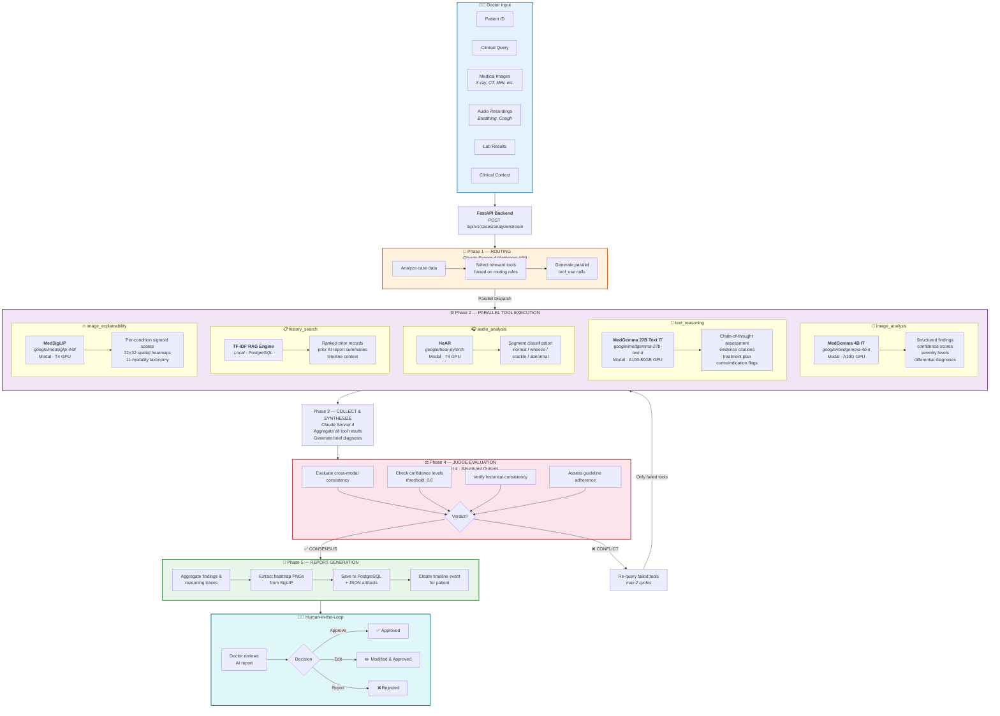

---

## Diagram 2 — System Architecture (Full Stack)

High-level architecture showing frontend, backend, databases, and external services.

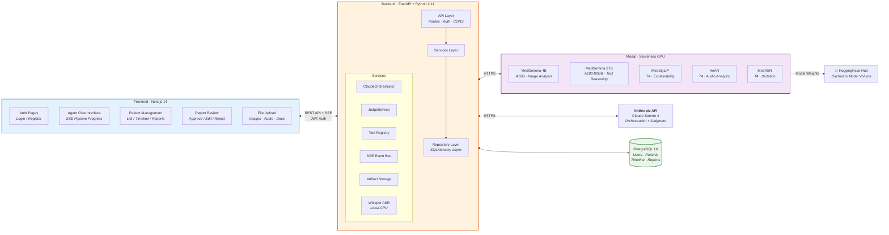

---

## Diagram 3 — Model Zoo & GPU Infrastructure

Detailed view of all AI models, their sizes, hardware, and purposes.

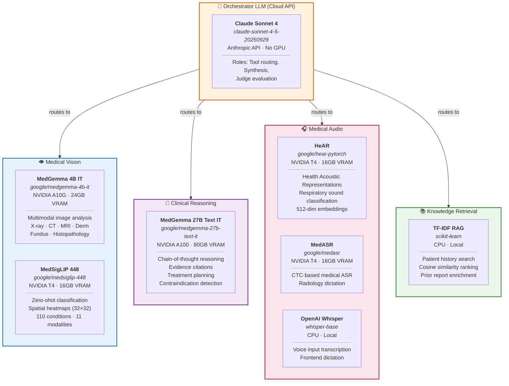

---

## Diagram 4 — Agentic Loop Detail (Orchestrator Internal)

Shows the internal loop of how Claude decides, dispatches, collects, and optionally re-queries.

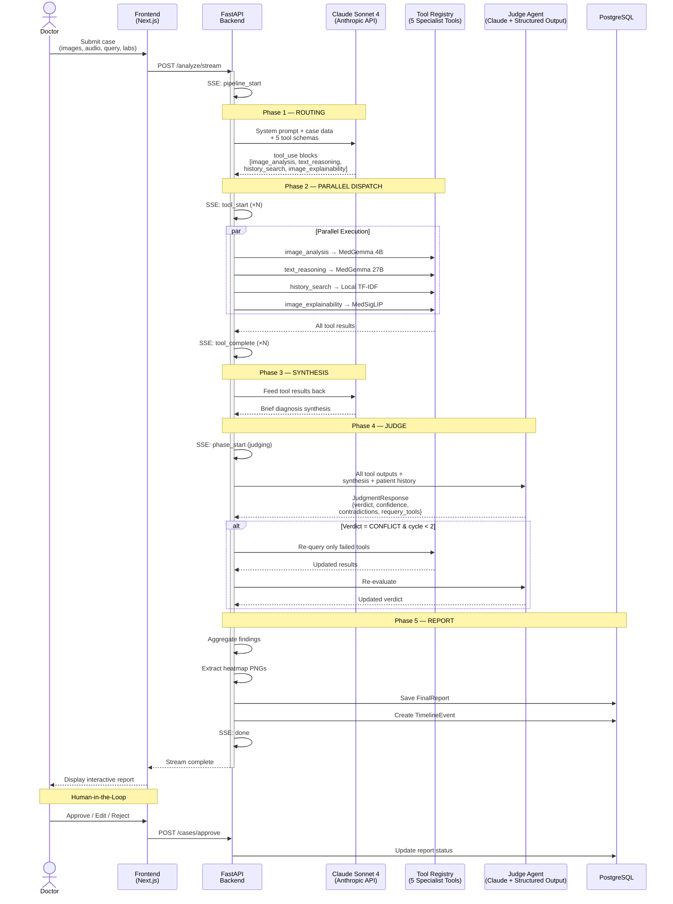

---

## Diagram 5 — Data Model / Database Schema

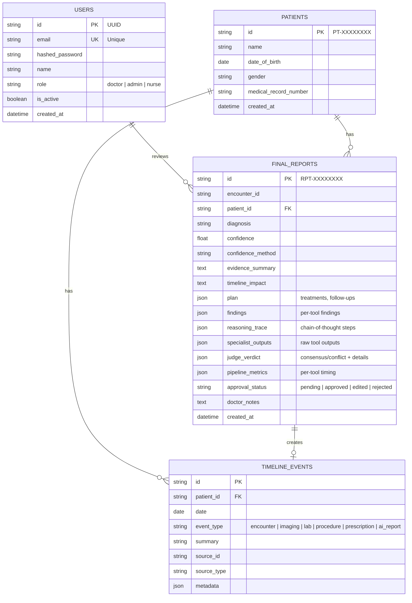

---

## Diagram 6 — Deployment Architecture

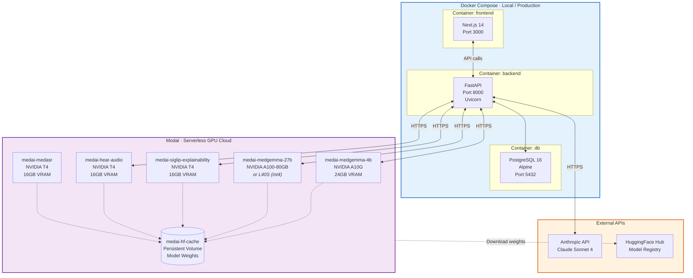

---

## Diagram 7 — SigLIP Explainability Pipeline

Detailed view of how image explainability works with MedSigLIP.

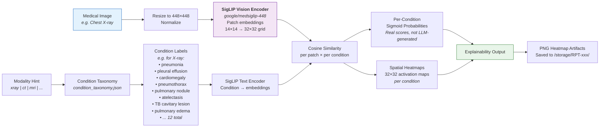

---

## Diagram 8 — Authentication & Authorization Flow

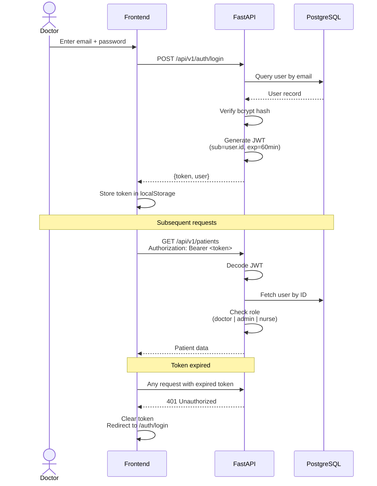

---

## Diagram 9 — Design Patterns Used

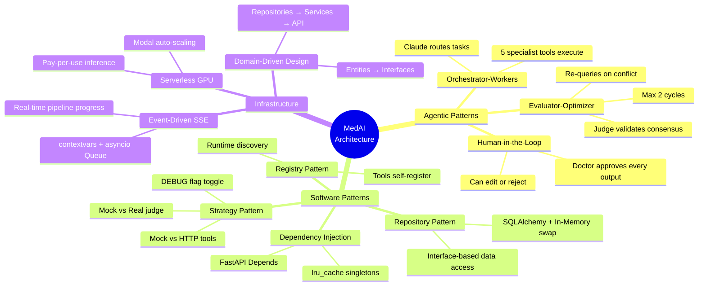

---

## Diagram 10 — Patient Timeline & Report Lifecycle

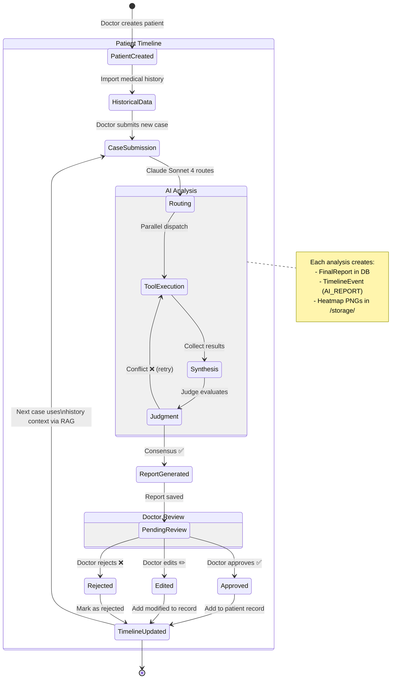

---

## Diagram 11 — Technology Stack Overview

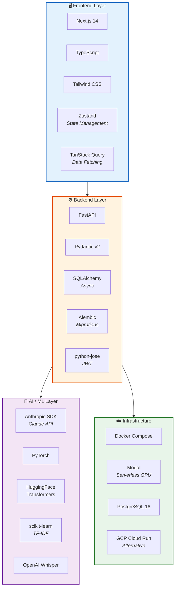
